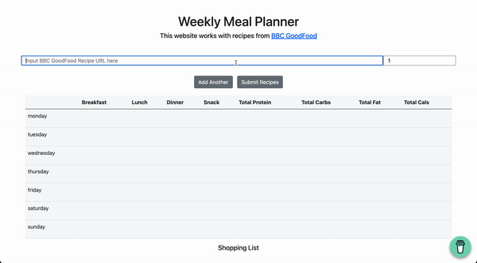

# mealplanner

A website which allows users to input a list of BBC GoodFood recipes and outputs a shopping list of combined ingredients. Also allows users to plan a week worth of meals (breakfast, lunch, dinner, snacks) in a drag-and-drop table and shows combined daily macros.

## Workflow

1. user puts multiple recipe url in form + number of servings they want from each
2. Scraper pulls all data for each recipe
    - servings it makes 
    - macros
    - ingredients list 
3. Calculate shopping list to satisfy all recipes and servings.
4. Drag and drop recipes into week table and output macros 
